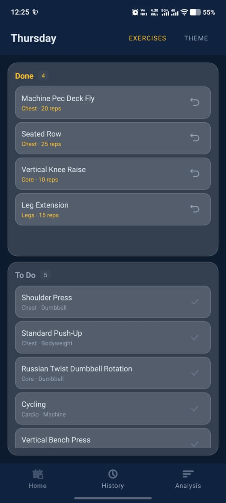
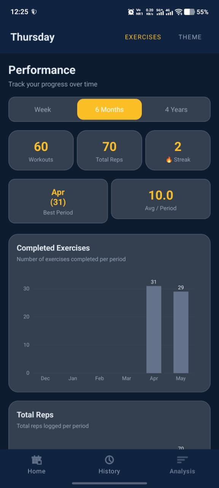
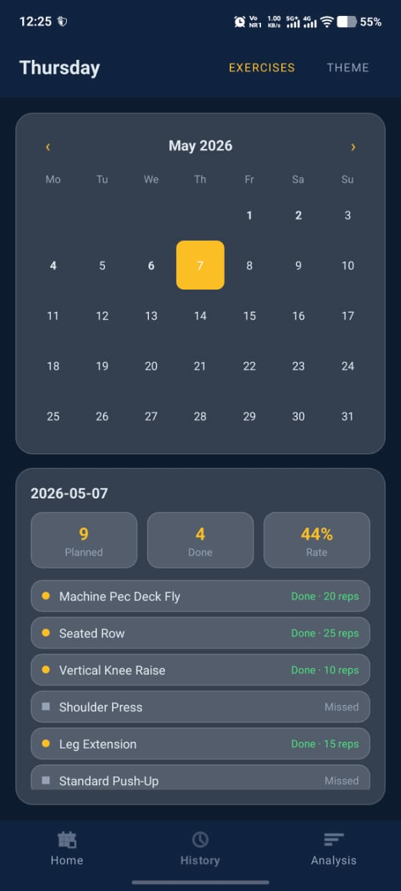

# GymTracker

A clean, offline Android gym tracker — schedule workouts by day, log sets with reps and weight, and analyze your performance over time.

Created by **Lav Kalsi**

[Download APK — v1.0](apkfile/GymTrackerV1.apk)

<br/>

## Home



The home screen shows today's workout split into two panels — exercises still to do and exercises already completed. Tap the checkmark on any exercise to log your reps and weight for that set. You can also drag an exercise across panels. Warmup exercises are pinned to the top of the list with a warmup label. The counters at the top of each panel update as you work through your session.

<br/>

## Analysis



The analysis page gives a full picture of your training over the last week, 6 months, or 4 years. At the top you get three stat cards showing total workouts completed, total reps logged, and your current daily streak. Below that are animated bar charts for workout volume and total reps per period, a donut pie chart breaking down which muscle groups you have been training, a horizontal bar chart for reps by muscle group, and a ranked list of your top 5 most completed exercises with their rep totals.

<br/>

## History



The history screen lets you browse every past workout session by date. Each entry shows the exercise name alongside its completion status, and if you logged reps and weight those are shown too — for example "Done · 12 reps · 80kg". Dates that have recorded sessions are highlighted so you can quickly jump to any day.

<br/>

## Features

- Weekly Schedule — Build a workout plan for each day of the week from a library of 400+ exercises across 8 muscle groups
- Exercise Search — Instantly search and filter by muscle group; create your own custom exercises
- Warmup Flag — Mark any exercise as a warmup and it pins to the top of your list
- Set Logging — Log reps and weight (kg) using a stepper or by typing directly when you complete an exercise
- Performance Dashboard — Bar charts, pie chart, streak counter, and top exercises
- Workout History — Browse every past session by date with reps and weight per exercise
- Theming — Six color presets (Slate, Ocean, Forest, Rose, Amber, Violet) with Dark, Blue, and White background styles
- Safe Migrations — SQLite upgrades with ALTER TABLE so your data is never wiped on update

<br/>

## Tech Stack

| Layer | Technology |
|-------|-----------|
| Language | Kotlin |
| UI | XML Views, ViewBinding, Material 3 |
| Architecture | MVVM — ViewModel + LiveData |
| Database | SQLite via SQLiteOpenHelper |
| Charts | [MPAndroidChart](https://github.com/PhilJay/MPAndroidChart) |
| Navigation | Fragment back stack |
| Min SDK | 33 (Android 13) |

<br/>

## Getting Started

1. Clone the repo
   ```bash
   git clone https://github.com/your-username/GymTracker.git
   ```
2. Open in **Android Studio**
3. Let Gradle sync
4. Run on a device or emulator (API 33+)

No API keys, no backend, no account needed — fully offline.

<br/>

## Project Structure

```
app/src/main/java/com/example/gymtracker/
├── data/
│   ├── DatabaseHelper.kt       # SQLite schema, queries, migrations
│   ├── ExerciseRepository.kt   # Data access layer
│   └── Models.kt               # Data classes
├── ui/
│   ├── adapter/                # RecyclerView adapters
│   └── fragment/               # All screens and dialogs
└── viewmodel/
    └── MainViewModel.kt        # Single shared ViewModel
```

<br/>

## License

```
MIT License — feel free to use, modify, and distribute.
```
